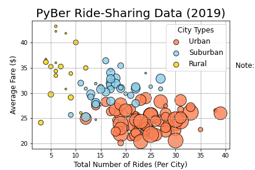
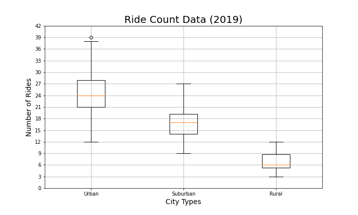
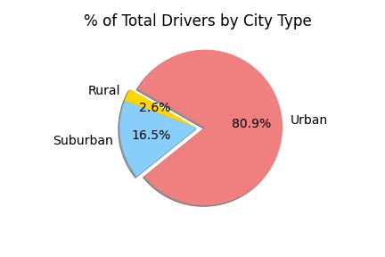
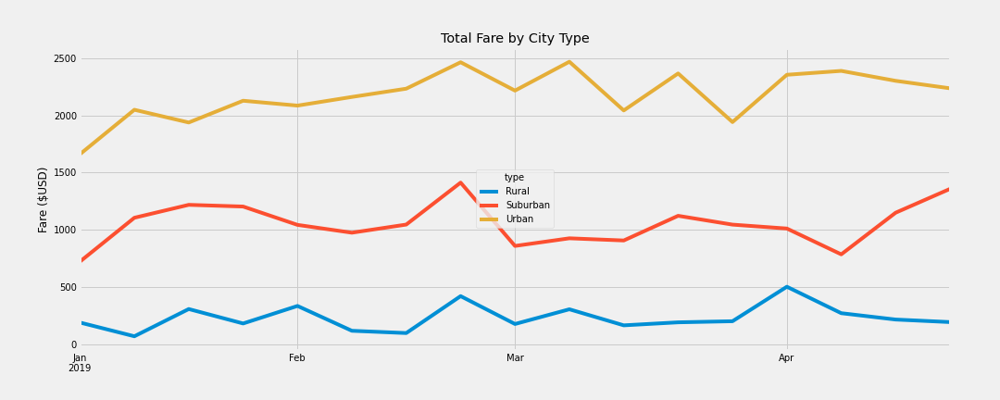
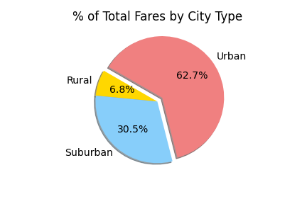
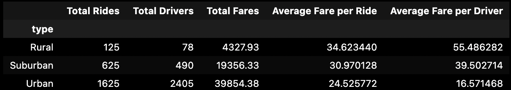

# PyBer_Challenge

 

## Project Overview
The purpose of this analysis is to create a summary of the PyBer ride-sharing data in rural, suburban and urban cities and recommend improvements based the findings.

## Resources
- Data Source: election_results.csv
- Software: Python 3.8.13, Visual Studio Code 1.38.1, Jupyter Notebook 6.4.12

## Results
### Total Rides Analysis 2019

- There were three types of cities in the sample data: rural, suburban and urban. The analysis shows the highest uses of the service comes from urban cities.

- Urban cities held the highest percentage of rides at 68% between January and May 2019. During this 5-month period, there were 1,625 rides in urban cities, 625 rides in suburban cities and 125 rides in rural cities. 
- The figure below shows the total ride count data.

### Total Drivers Analysis
- The analysis shows there is a greater demand for Pyber services in Urban areas, with 80% of drivers driving in urban cities.

    
### Total Fares Analysis

- Urban cities during January 2019 and May 2019 had 62.7% of total fares ($39854.38). Suburban and rural cities contributed 30.5%($19,356) and 6.8%($4,328) to total fares, respectively. 

### Average Fares Analysis
- While rural cities had the lowest percentage of total fares, rural drivers saw $34.62 average fare per ride and $55.49 average fare per driver.

    

- The average fare per ride analysis shows that urban cities trend lowest in cost per ride at $24.53. Rural riders are charged $10 higher on average at $34.62, which could result in lower patronage in rural areas.

    

## Summary
- A standout trend from the analysis: urban drivers take more fares and are making less per ride, while rural cities have few drivers with higher average fares. 
- One solution to serve both drivers and riders maybe to incentivize drivers to take more fares in lower-density areas.
- This incentive program could raise fares for urban drivers and populate rural and rural areas with more drivers.
- Another possibility could be to offer discounted fares for certain hours or events in rural areas.
- Finally, PyBer may consider offering a bonus to drivers for taking 70% of their fares in underserved cities. 